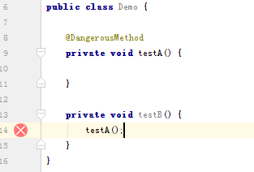

# PluginDemo
some demo show intellij plugin

##MainMenu

  show plugin in mainMenu with two method, action and componment! (this demo just for learning)

  效果图：

  

  

##MethdMask

  [Download](https://github.com/CzwAthou/PluginDemo/blob/master/MethodMask/MethodMask.jar "MethodMask.jar")

  when your method mark an Annotation with  [DangerousMethod.java](./MethodMask/DangerousMethod.java "DangerousMethod.java") and Anywhere you call this method, will tips you this method is dangerous, and on left wiondow will show an error icon! 

 
  效果图：

  
 

###NameConvert

  [Download](https://github.com/CzwAthou/PluginDemo/blob/master/NameConvert/NameConvert.jar "NameConvert.jar")

  1, this plugin will help you format your field! When you press SHIFT+I, it will format your select text like this:

  

  And you also can change the format rule in Setting -> Other Setting -> NameConvert 

  

	
  2, When you press SHIFT+T, the plugin will translate the text you select!

  
